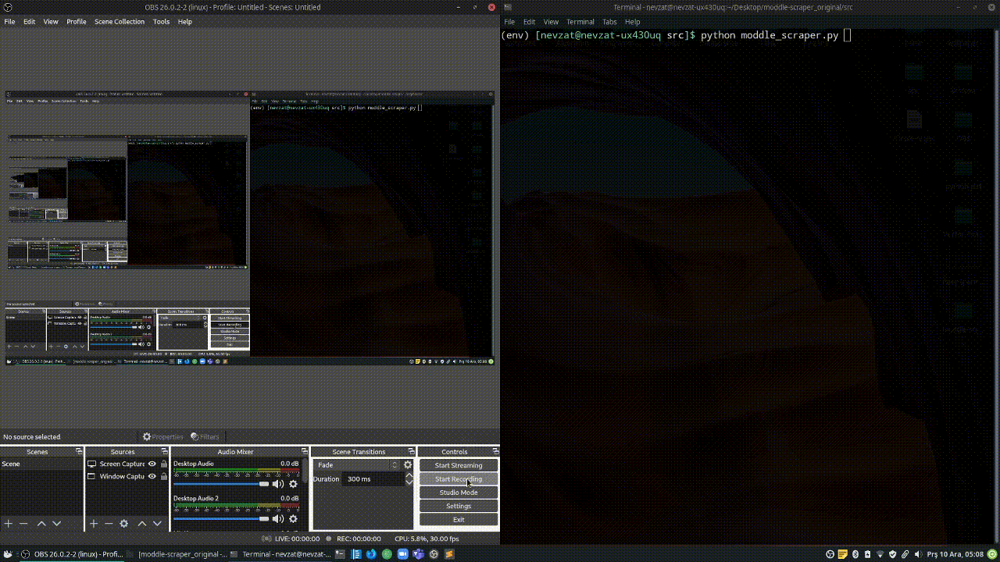

### Description
- I am fed up launching moddle page and viewing lectures via browser by hand and write basic automation tools.
- **Note**: It is written in 1-2 hours, there might be lots of bugs, **but** it performs work. Please just smile and do not care.

### Made by
- Selenium WebDriver (automating browser)
- Check out the ```Requirement.txt```

### How to run
- webdriver detail: ```ChromeDriver 87.0.4280.88```
- you can change the driver according to your ```Chrome``` version
- ```I will write further more after midterms```

### Contact
- Let me know for reporting bug or making suggestion
    - nevzatseferoglu@gmail.com





